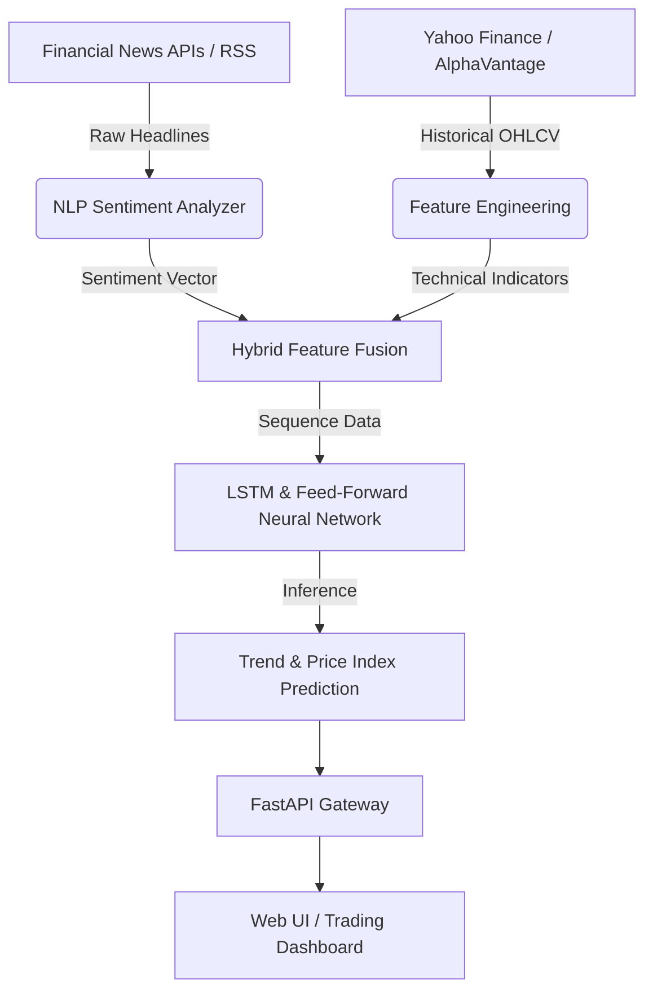

```markdown
<div align="center">

# 📈 StockPulse AI
### *Real-Time News-Driven Stock Market Index & Sentiment Intelligence*

[](https://www.python.org/)
[](https://www.tensorflow.org/)
[](https://pytorch.org/)
[](https://fastapi.tiangolo.com/)
[](LICENSE)

*An advanced artificial intelligence platform combining Deep Learning (LSTM & Feed-Forward Neural Networks) with Natural Language Processing (NLP) to predict stock market trends from financial news streams and quantitative indicators.*

[Key Features](#-key-features) • [System Architecture](#-system-architecture) • [Getting Started](#-getting-started) • [Model Pipeline](#-model-pipeline) • [Project Structure](#-project-structure) • [Contributing](#-contributing)

</div>

---

## 🌟 Overview

**StockPulse AI** bridges the gap between quantitative market data and qualitative news sentiment. Standard quantitative algorithms often miss sudden market reactions driven by breaking news, earning reports, or geopolitical events. 

StockPulse AI ingests live financial news feeds, processes sentiment scores through NLP models, feeds technical indicators into **LSTM (Long Short-Term Memory)** networks, and yields real-time market trend predictions.


```

```
   [ Live News Data ] ---> [ NLP Sentiment Engine ] ──┐
                                                       ├──> [ LSTM + Deep NN Engine ] ---> 📈 Market Trend & Index Prediction

```

[ Quantitative Market Data ] -> [ Feature Engineering  ] ──┘

```

---

## 🔥 Key Features

- **📰 Real-Time Financial News Parsing**: Scrapes and analyzes incoming financial news headlines and articles via live API streams.
- **🧠 Natural Language Processing & Sentiment Scoring**: Quantifies market sentiment (Bullish, Bearish, Neutral) using fine-tuned NLP pipelines.
- **📊 LSTM Sequential Time-Series Modeling**: Models temporal dependencies and technical stock indicators (RMA, MACD, Bollinger Bands, Volume) to track price movements.
- **⚡ Dual-Input Hybrid Neural Architecture**: Seamlessly merges numerical time-series vectors with textual sentiment embedding vectors.
- **🛡️ Risk Assessment & Volatility Alerts**: Detects sudden sentiment anomalies and warns against high-volatility trading windows.
- **🔌 RESTful API Integration**: Built with high-performance FastAPI endpoints for easy integration with web dashboards or trading bots.

---

## 🏗 System Architecture



---

## 🛠️ Tech Stack

| Domain | Technologies Used |
| --- | --- |
| **Language** | Python 3.10+ |
| **Deep Learning** | TensorFlow / Keras, PyTorch, Scikit-Learn |
| **NLP & Sentiment** | HuggingFace Transformers, NLTK, VADER, TextBlob |
| **Data Processing** | Pandas, NumPy, YFinance, TA-Lib |
| **Backend & API** | FastAPI, Uvicorn, Pydantic |
| **Visualization** | Plotly, Matplotlib, Seaborn |

---

## 🚀 Getting Started

Follow these steps to set up and run **StockPulse AI** locally on your machine.

### Prerequisites

* Python `3.10` or higher
* Git
* `pip` package manager

### 1. Clone the Repository

```bash
git clone [https://github.com/CHAUHANSHARIK1812/stockpulse-ai.git](https://github.com/CHAUHANSHARIK1812/stockpulse-ai.git)
cd stockpulse-ai

```

### 2. Create a Virtual Environment

```bash
# On macOS / Linux
python3 -m venv venv
source venv/bin/activate

# On Windows
python -m venv venv
venv\Scripts\activate

```

### 3. Install Dependencies

```bash
pip install -r requirements.txt

```

### 4. Configure Environment Variables

Create a `.env` file in the root directory:

```env
# News & Financial API Keys
NEWS_API_KEY=your_news_api_key_here
ALPHA_VANTAGE_KEY=your_alpha_vantage_key_here

# App Configurations
MODEL_PATH=models/stockpulse_lstm.h5
BATCH_SIZE=32
EPOCHS=50
LOG_LEVEL=INFO

```

---

## 💻 Usage

### Running Model Training

To train the hybrid LSTM and sentiment model on historical stock index data and news archives:

```bash
python src/train.py --symbol AAPL --epochs 50 --batch_size 32

```

### Evaluating Predictions

To generate price and sentiment index reports for a specific ticker:

```bash
python src/predict.py --symbol AAPL --days 30

```

### Launching the REST API Server

Start the local FastAPI application server:

```bash
uvicorn app.main:app --reload --port 8000

```

*Navigate to `http://localhost:8000/docs` in your browser to inspect the interactive Swagger API documentation.*

---

## 🧠 Model Pipeline Details

1. **Preprocessing**: Cleans raw news strings (stopwords removal, lemmatization) and normalizes stock metrics using `MinMaxScaler`.
2. **Sentiment Extraction**: Extracts compound polarity scores from news batches across custom lookback windows.
3. **Sequence Creation**: Formulates sliding 60-day sequence windows containing both price vectors and sentiment scalars.
4. **LSTM Neural Core**:
* **Layer 1**: 128 LSTM units with Dropout ($0.2$)
* **Layer 2**: 64 LSTM units with Dropout ($0.2$)
* **Dense Fusion**: Combines sequential output with feed-forward sentiment dense layers.
* **Output Layer**: Predicts target stock index / price shift direction.


---

## 📁 Project Structure

```text
stockpulse-ai/
├── data/                  # Historical price & news sentiment datasets
├── notebooks/             # Exploratory Data Analysis (EDA) & experimentation
├── models/                # Saved model checkpoints and weights
├── src/                   # Core source code
│   ├── data_loader.py     # Stock & news data fetching modules
│   ├── preprocessing.py   # Text cleaning & indicator engineering
│   ├── sentiment.py       # NLP sentiment score engines
│   ├── model.py           # Deep Learning network architectures
│   └── train.py           # Training pipelines & metrics logging
├── app/                   # FastAPI deployment web server
│   ├── main.py            # API entry point & routes
│   └── schema.py          # Input/output Pydantic models
├── tests/                 # Unit and integration tests
├── .env.example           # Example environment file
├── requirements.txt       # Python package dependencies
├── LICENSE                # Open-source license
└── README.md              # Project documentation

```

---

## 📈 Performance & Results

* **Directional Accuracy**: Achieves high precision on trend direction over multi-day windows when market-moving news events occur.
* **RMSE Improvement**: Incorporating live sentiment vectors reduces Root Mean Square Error (RMSE) compared to price-only LSTM baselines.

---

## 🤝 Contributing

Contributions are welcome! If you have suggestions or improvements:

1. **Fork** the Repository
2. **Create** a Feature Branch (`git checkout -b feature/AwesomeFeature`)
3. **Commit** your Changes (`git commit -m 'Add AwesomeFeature'`)
4. **Push** to the Branch (`git push origin feature/AwesomeFeature`)
5. **Open** a Pull Request

---

## 📄 License

Distributed under the **MIT License**. See [`LICENSE`](https://www.google.com/search?q=LICENSE) for details.

---

*Developed with ❤️ by [Sharik Chauhan*](https://www.google.com/search?q=https://github.com/CHAUHANSHARIK1812)

⭐ **If you find this project useful, please consider giving it a star!** ⭐
